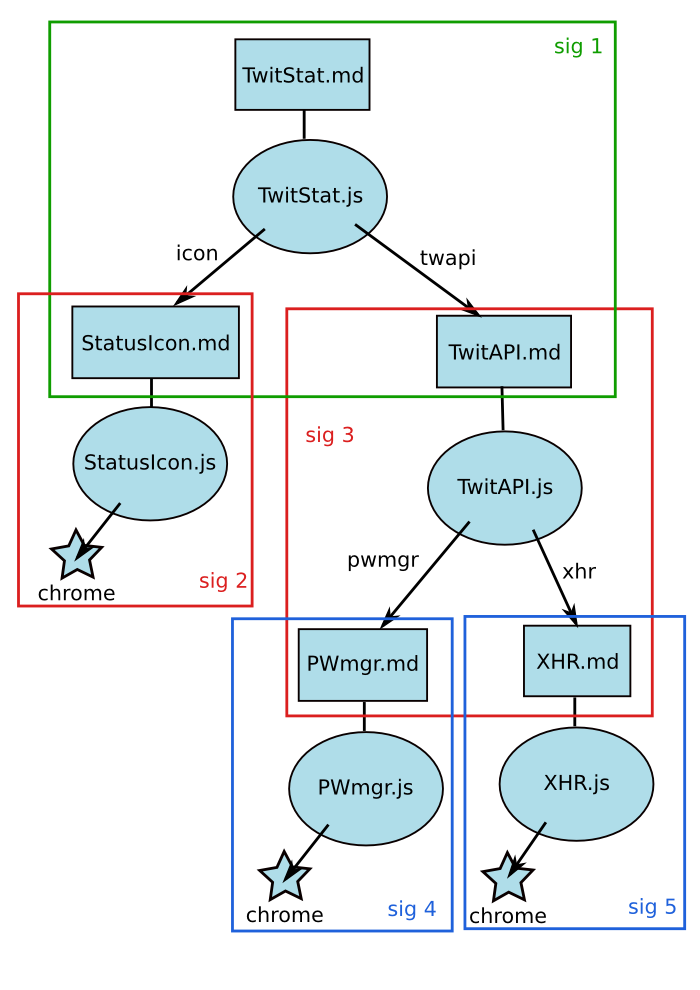

# Jetpack Module-Graph Analysis Tool

## Executive Summary

> We build an analysis tool, as a web service. Developers upload XPIs to this
> service. They are unpacked and dissected. Each module inside the XPI gets a
> review page which shows the code, has tools to discuss each line (add/show
> comments), and provides buttons to "sign-off" on the module. When reviewers
> have approved all modules in an XPI, that XPI plus the approval signatures
> can be downloaded and installed in a browser. Browsers will reject XPIs
> that contain modules not approved by a configurable signing key.

## Background

The general idea is that modules provide authority: if your code does
require("xhr") (and is allowed to run at all), it will wind up with
unrestricted XHR-based network access, which is a power that not all programs
should get. The user's decision to run your code is based upon comparing the
likely benefits it provides against the likely risks, and the risks are
bounded by the authority your code is given. As the add-on is built from a
tree of modules (starting with the top-level "main" module, finishing with
low-level chrome-authority-using API modules like the ones in the SDK's
"jetpack-core" package), the authority granted to each module is determined
by the submodules it is allowed to require().

Most users will implicitly delegate this decision to the AMO reviewers, who
effectively reduce the user's decision making power to: read the add-on
description, then decide whether to install or not. These reviewers are
tasked with deciding whether the description adequately condenses the
add-on's risks and benefits in a user-meaningful way, and if so, they
"approve" the add-on, making it visible to certain search pages and
galleries. Reviewers base this decision upon automated+manual code analysis
(to look for vulnerabilities) and manual testing (to look for features),
which does not give reviewers a lot of time to spend on each add-on. We would
like to improve the efficiency of review, by maximizing the analysis that a
reviewer can do in a fixed amount of time.

One of the goals for improving the security of Jetpack-based add-ons is the
"Principle Of Least Authority" (POLA). This means each component should have
as little power as possible, so that it something goes wrong (an accidental
bug, intentional violation, or malicious compromise), the damage can be
contained.

This proposal seeks to address both of these goals together. Within the
add-on, strong confinement will make it possible for modules to protect their
internal state and prevent authority leaks. Reviewers will approve each
module separately according to how well it protects that state (i.e. the
"xhr" module must only grant XHR access, not other chrome powers), and how
well it provides the intended functionality. The top-level module is reviewed
according to how well it provides the advertised services and how
appropriately it requests/uses authority.

Each add-on XPI bundle will include a machine-generated, machine-readable
manifest which defines the "module graph": a description of which modules
import which other modules, using cryptographic hashes of each .js file as
secure module identifiers. The runtime loader will enforce the manifest: it
will check the hashes as the modules are loaded. The loader will also check
that the manifest entries are "approved", by looking for cryptographic
signatures that cover certain portions of the manifest. In this fashion,
reviewers express their opinions about module code, and the add-on loader
enforces those opinions.

My original (["Jetpack Components"](components.md)) design called for an
"interface" that sits between each implementation component, and reviews
which state that a given JS file would correctly provide the interface. The
interface provided a buffer or abstraction boundary between modules, making
it possible to isolate changes: when a top-level module depends upon some
lower-level API module, and the low-level module is upgraded, as long as the
new version is reviewed and found to still provide the same interface as
before, then the top-level module does not need to be re-reviewed. In the
absence of boundaries like this, any change to any low-level module would
require a complete re-review of all the modules that use it.

In this new approach, these interfaces are represented by the existing
Markdown documentation files for each module, rather than being defined by
some external entity.

## Example

This example represents a twitter status-checking add-on, which updates a
status-bar icon with the number of unread messages. The add-on -specific code
is split into two pieces: a low-level "TwitAPI" module (which handles the
details of the twitter API), and a high-level driver module. Three
SDK-provided modules are referenced too, allow which require chrome
authority: StatusIcon, PWmgr (to access the password manager, for the
twitter.com password), and XHR (to perform HTTP requests).

The TwitStat.js file contains two require() statements:

    var icon = require("StatusIcon");
    var twapi = require("TwitAPI");

Likewise, the TwitAPI.js file contains a 'var pwmgr = require("PWmgr");' and
a 'var xhr = require("XHR");'.

## Module Signatures

When reviewers sign off on one of the modules inside a Jetpack-based XPI,
they are making a recommendation about the quality and safety of the code
therein. This recommendation is specific to a given purpose: the module may
contain a fast, safe, bug-free implementation of a useful gaussian-blur
image-processing algorithm, but if the documentation claimed that it provides
a poetry-analysis module, then the literary analysts developing
rhyme-visualization tools on top of it will be quite disappointed.

Their recommendation is also based on the assumption that the module's
dependencies do what they're supposed to do (as defined by their own
documentation). Ideally, reviewing one module should not require also
reviewing all of the modules that it depends upon: if that were the case, a
change in any component would force a complete re-review of every add-on
which used it. (in an unconfined language, or if modules are not written in a
defensively-consistent style, this unfortunate deep-review becomes necessary;
pruning the review horizon at the dependency-interface boundary is not safe
in such an environment).

The reviewer's approval is expressed as a cryptographic signature, using a
key that the browser will recognize later. To capture all of the preceding
things that their recommendation covers, that signature needs to be computed
over a data structure with the following contents:

- module purpose (e.g. the docs/TwitStat.md documentation in "sig1")
- module implementation (e.g. lib/TwitStat.js)
- mapping from dependency name (e.g. the argument to require()) to the
   documentation of the module that will be loaded to satisfy the dependency
   (e.g. the docs/TwitAPI.md file, assuming that package-ordering and
   link-time configuration results in the TwitAPI module being loaded).
- whether the TwitStat.js module uses chrome authority or not

Each sign-off results in a signature over this 4-tuple.

- ( H(md), H(js), {name1: H(dep1.md), name2: H(dep2.md), ...}, haschrome )

If the dependency module doesn't have an .md file, the signature should
include the dependency's .js file. Losing the indirection means that any
change to the child code will incur a re-review of the parent module.

The hash used to identify each component (e.g. H(TwitStat.js)) needs to
include any per-module metadata that might affect the way it is loaded.

In our example, there will be five module signatures (starting with a
signature for the top-level module, described below):

- sig1: ( H(TwitStat.md), H(TwitStat.js),
          {icon: H(StatusIcon.md), twapi: H(TwitAPI.md)}, false )
- sig2: ( H(StatusIcon.md), H(StatusIcon.js), {}, true )
- sig3: ( H(TwitAPI.md), H(TwitAPI.js),
          {pwmgr: H(PWmgr.md), xhr: H(XHR.md)}, false )
- sig4: ( H(PWmgr.md), H(PWmgr.js), {}, true )
- sig5: ( H(XHR.md), H(XHR.js), {}, true )

### Bundled Data

The `data/` directory contains arbitrary data (not generally code) which can
be accessed with the `require("self").data.load(FILENAME)` and
`require("self").data.url(FILENAME)` calls. This is specified to provide data
from the same package as the code invoking `require("self")`, to allow
packages to hide data from other packages. This data is *only* available
through the `self` module, although the `data.url()` form returns a
capability URL which can subsequently be passed to arbitrary other users.

To capture the behavior-influencing aspects of this data, any module which
uses the `self` module will include a hash of all bundled data in its
manifest signature. Each data-bearing package will generate a JSON file
containing a mapping from `FILENAME` (including slashes: this is the argument
to `data.load()` or `data.url()`) to a XPI-relative filename and the hash of
the file's contents. This JSON file will be stored in the XPI, and its hash
will be included in the `self`-using module's manifest entry.

Modules which do not use `self` will not have a data-hash included in their
manifest line. As a result, they do not need to be re-reviewed when the
bundled data changes.

We still need to think through the implications of this, especially if
`data/` is used to hold page-mod scripts (which affect add-on behavior even
more drastically than plain old HTML/image data). It is useful to avoid a
re-review of code when data has changed, but since bundled data will affect
program behavior (if the code makes decisions on the basis of e.g. a static
JSON table), or user behavior (if the data contains UI elements that a human
will use to decide which button to push), it needs to be reviewed
*somewhere*.

## Add-on Signatures

Most modules export an API object to their callers, and are used because some
higher-level module wants their functionality or authority. But the top-level
module is different: it is requested by end users, and its utility is a
side-effect of being loaded, rather than explicitly provided by an exported
API object.

The top-level module's description is presented to end-users as the benefits
they can hope to receive in exchange for installing the add-on (i.e. its
description). The module signature must cover this human-readable
description: as before, if the description claims that the add-on is an
ad-blocker, then users are going to be unhappy if it is actually a
pig-latin-translator, no matter how superbly it might be written.

If the top-level add-on description is stored in a special file (e.g.
README), rather than in the usual docs/MODNAME.md, then the signature code
needs to know the distinction between top-level and non-top-level modules,
and it needs to read the correct file when building the signature.

## The Review Tool

I propose to build a web service on which reviewers can examine modules,
exchange questions and conclusions, and create review signatures.

Developers upload their generated (but not-yet approved) XPIs to this
service. The XPI is unpacked, and its contents incorporated into a large
database. Reviewers can quickly identify which components in the add-on have
already been approved (perhaps because they match the versions distributed in
the Jetpack SDK, or perhaps because they were reviewed after being included
in some other add-on). The remaining not-yet-approved components are
highlighted as needing review.

Each add-on gets a page which shows its top-level description and a list of
all of its modules, starting with the top-level module (which is generally
not shared with any other add-on), and including all transitively-included
modules (many of which will be copied from the SDK and be referenced by lots
of add-ons). Each module is shown with an approval status (red or green), and
a link to a per-module page where the actual review takes place.

The per-module review pages will show:

- description of what the module claims to do (docs/twitter-api.md)
- source code of the implementation of the module (lib/twitter-api.js)
- a big flag indicating whether it has chrome authority or not
- a line for each require() dependency

The dependency lines contain the require() name, an approval status (red or
green), and a link to the per-module page for the module that this particular
XPI will use to satisfy the require() statement. Both the .md and .js viewer
pages should have facilities for commenting on specific lines, like GitHub,
Mondrian/Rietveld/ReviewBoard, or other code-review tools. There should also
be a place for comments on the module as a whole.

Note that the same .md/.js combination in two different XPIs may both use
require("foo"), but get linked against different modules: if the foo.md files
in each XPI are different, then these two reviews are separate and
independent (the first foo.md might talk about a foo.js that talks about an
ad-blocker, and the second foo.md might describe the pig-latinizer, and the
reviewer needs to know which behavior is being claimed). So the per-module
review page shows a single module in the context of a specific add-on bundle.

However, the review page should contain links to similar modules in other
contexts. For example, if we're reviewing addon-1, which contains a specific
foo.js, but some other addon-2 also contains a foo.js with the same source
code (but which might reference different dependencies, because the addon-2
XPI was built with a different version of the SDK, or contain a different
foo.md description), then there should be hyperlinks available so reviewers
can look up the discussion that took place in the addon-2 context, view the
differences between the two modules, and generally leverage the earlier
review effort by focusing on the differences rather than repeating the whole
review.

Likewise, if we have some indication that module B is an upgrade to module A
(perhaps because they are imported with the same require() name, or because
they have a lot of lines in common, or because B contains some piece of
metadata that claims it is related to module A), then it would be useful for
their review pages to have cross-links, with diffs.

An XPI which uses entirely components from the SDK plus a single homebrew
top-level component will have one red page (for the top-level module) that
contains a set of green lines (since all SDK components will have been
reviewed already).

When all the add-on's components have been approved, a "signature sidecar" is
assembled, and the ready-to-install augmented XPI is made available for
download.

### "Approved": by whom?

Firefox users are fundamentally in charge of their own browser: we are not
building an "App Store", Firefox will never have DRM, and Mozilla will not
make it difficult for users to install the add-ons of their own choosing.
However, we do have a responsibility to help users make good choices about
their browser's health, and the vast majority of our users have neither the
time nor the training to perform a detailed examination of the add-ons they
might install.

So a compromise position is required, in which there is a slight "energy
barrier" that encourages most users to stick with the approved "safe"
add-ons, but which can be bypassed with a bit of determination. Users
implicitly delegate their decision-making authority to a set of reviewers,
known as a "review panel", such that installing add-ons which these reviewers
have approved is an easy one-click process, whereas installing other add-ons
is more labor-intensive and somewhat scary.

While the default review panel for e.g. Firefox will be the
addons.mozilla.org team, it should be possible to configure a browser to
accept a different set. For examine, in an enterprise environment, the
corporate IT department may create and approve their own add-ons, and might
not want to accept AMO-approved add-ons at all.

So, in this review tool, the notion of "approved" really means "approved by
one or more reviewers from panel X", where "X" is probably a pet-name for a
specific signing key or a set of signing keys. Each page which shows
approvals should have an indication of which reviewer panel is being used to
filter the known approvals, and provide a link to a page that contains a full
list (including the approvals from other panels). Users of the review tool
should be able to switch between review panels with a preference of some
sort.

### Reviewing After Upgrade

Changing the implementation of a module (but leaving the .md file alone) will
require one review of the new binding (somebody must certify that the new
implementation still provides the same interface), after which any XPI which
is relinked (and picks up the new bar.js) will be trivial to review (the
top-level code has not changed, and all dependencies are green).

Changing the interface of a module requires more review: any relinked XPI
must be re-reviewed (the dependency line is red), because the top-level code
was expecting a certain interface, and that interface has changed, so the
analysis must be redone.

Splitting a module into two pieces (but not writing a .md file for the
included piece, such as when you don't intend to publish the internal piece
for use by others) causes the top-level piece to acquire a dependency on the
actual .js implementation of the included piece. Any changes to that piece
require re-review of the top-level component.

## Packing The Signature Sidecar

When all modules in an add-on (including the top-level module) have been
reviewed, their sign-off signatures are aggregated into a file, and a new
bundle is created which contains the list of signatures. This bundle is
distributed to end-users through AMO. When the browser unpacks the bundle, it
checks all the signatures against the configured
who-is-allowed-to-review-addons key and discards any which aren't from a
known key. It then makes the review tuples available to the loader.

## The Loader Checks Approvals

The loader's job is to build a module graph in memory that satisfies the
constraints imposed by the signature list. Each node in this graph represents
a single module (with a .js file), and a mapping from require() names to
other module nodes. The node also has a "has_chrome" flag.

The signature list provides constraints: the loader must not add a node to
the module graph that is not approved by the signature list. Since the
signature list is built by reviews of the modules in the uploaded XPI, and
the downloaded XPI includes both the uploaded XPI and the signature list, the
only way for a mismatch to occur is if someone manually (and probably
maliciously) unpacked and repacked the bundle with different components. The
signature list prevents this in an end-to-end fashion.

The loader starts with the top-level module and performs a deep-traversal of
the uploaded-XPI manifest. For each module therein, it checks the signature
list. Approved module nodes are added to the graph on the traverser's way
back up.

## XPIs vs A New Packaging Format

As long as Firefox accepts XPIs as installation packages for add-ons, the
browser will not directly provide any least-authority security protections.
An attacker who wishes to take over your browser will create a non-Jetpack
add-on which does something nasty, and advertise it to you as the world's
greatest pig-latin translator, knowing that you are an avid user of
pig-latin. The Firefox add-on manager has no facility to show the user
anything about the add-on as it is being installed, nor does it ask the user
for approval after the download+install process has begun. The main
protection it does provide is to refuse to install XPIs from sites other than
addons.mozilla.org .

In the "Loader Checks Approvals" approach, the bootstrap harness code (i.e.
the first JS code that is executed upon XPI installation) is the same for all
Jetpack-based add-ons, and is responsible for enforcing all other security
properties. AMO should only publish add-ons which contain a bootstrap.js that
matches the known-good version from the SDK (and the review tool should hash
its contents to help reviewers spot this).

A future version of the add-on manager should change the UI flow to first
download the add-on, then unpack and examine it (at which point the manifest
signatures could be checked), then display the add-on's embedded description
to the user and ask whether to proceed. If the examination process did no
more than require a signature on the bootstrap harness code, then end-to-end
security properties could be achieved without relying upon the AMO download
site at all.

A new add-on manager could also use a different installation process for
add-ons, which ignored the usual XPI entry point, and instead started
directly with the manifest and its signatures. Such XPIs could be installed
less-securely by older browsers (by the old add-on manager), and
more-securely in newer browsers (with a new add-on manager).

## Problems

This approach lacks the "assembly document" described in my JetpackComponents
proposal/discussion, and instead relies upon the review of the top-level
module to capture the same information. I think this fails to handle things
like parameterized restrictions on included modules (e.g. the domain name to
which a LimitedXHR is limited *to*).

Some part of me suspects that the overall add-on needs an extra signature,
which covers a list of all modules being used, as well as the description of
what the add-on is supposed to do.

Libraries (modules which come with no authority requirements) can probably be
treated like normal modules, if they are called through a fairly narrow API.
However, the isolation/confinement techniques we're considering probably
preclude traditional inheritance. We may need a different import mechanism to
permit non-isolated composition. In this case, the imported-but-not-isolated
library (the "importee") must be considered to be part of the importer's
code: every line of the library could affect the behavior of the importer.
This increases the review burden: when jQuery.js is changed, every add-on
which uses it must be re-reviewed.

## XPI Files

This is a list of all the files created by the manifest generator and added
to the XPI, along with their formats:

* `install.rdf` : tells the Firefox Add-On Manager about the add-on. Contains
  the ID, version-compatibility information, and a flag that tells the
  application to use "bootstrap.js".
* `bootstrap.js` : basic bootstrap file
* `loader.js` : jetpack-specific loader, responsible for checking signatures
  against the manifest and loading/evaluating all JS files
* `manifest.json`: array of:
 * XPI filename of module's JS: $PACKAGE-lib-$FILENAME.js
 * SHA256 hash of module's JS (as a hex string)
 * XPI filename of module's docs: $PACKAGE-docs-$FILENAME.md
 * dictionary with keys that are arguments to `require()`, and values that are integer indexes into the `manifest.json` array
 * boolean: true if the module uses chrome authority
 * `$PACKAGE-data.json`, or null if the package does not use bundled data
 * SHA256 hash of `$PACKAGE-data.json` (as a hex string), or null if the package does not use bundled data
* `manifest.sig.json`: array of (jetpack_id, base32 verifying key, base32 signature)
* `$PACKAGE-data.json`: ...
* `$PACKAGE-data-FILENAME`: bundled data
