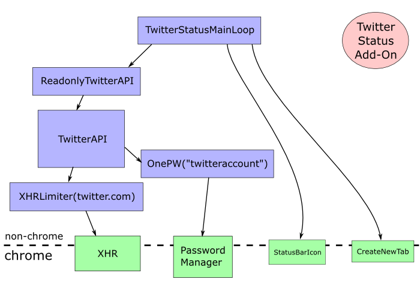

# My Crazy Jetpack Components Idea, or, "Wouldn't It Be Cool If..."

## Goals
- promote real code reuse at the module level, not just cut-and-paste of
  code snippets
- provide a formal centralized place for discovery, review, discussion, and
  use of components
- create incentives for writing reviewable+reusable components, each of which
  uses the minimum necessary authority to do its job

## Summary
- Jetpack addons consist of stacks of components, each providing a specific
  API to its clients (above), and using specific APIs of its dependencies
  (below)
- components are isolated from one another except for their published API
  object, maintain defensive consistency, and protect their private internal
  state
- components are immutable first-class objects on a web service, where they
  can be uploaded, reviewed, discussed, signed-off-upon, searched,
  downloaded, and incorporated into add-on bundles

## Example

A Twitter statusbar tool: once installed, this add-on will display an icon in
the statusbar that is updated with the number of unread tweets in the
configured account. Clicking on it will open a new tab to the user's Twitter
inbox. This add-on requires access to the user's Twitter account credentials,
but should be written in such a way that only a minimal subset of the code
actually sees those credentials or can perform Twitter API operations. The
top-level code should have read-only access to the Twitter API.

This add-on would consist of a stack of components:

- top-level code: has access to ReadOnlyTwitterAPI, StatusBarIcon, and
  CreateNewTab
- ReadOnlyTwitterAPI: has access to TwitterAPI
- TwitterAPI: has access to PasswordManager["twitter"] and XHR
- PasswordManager: an object which is parameterizes with a specific
  service/site name and grants access to the associated password
- XHR: provides access to XMLHTTPRequest (and nothing else)
- StatusBarIcon: provides access to an API that creates an icon in the
  statusbar, updates its content, and delivers click events upwards
- CreateNewTab: provides an API that accepts a URL and opens a new tab

## Definitions

**Principle Of Least Authority (POLA)**: each component of a software system
should have as little power/authority/permission as necessary to do its job.
A JPEG renderer should have the ability to set pixels, not read arbitrary
memory or send network messages. By minimizing the authority of a given
object, we reduce the damage of a compromise or exploit: tricking the JPEG
renderer into doing our evil bidding should result in nothing worse than bad
pixels. Maintaining private internal state is a bare minimum requirement to
achieve POLA: it needs a memory-safe language in which objects can force
callers to use well-defined access paths to manipulate their internal state.

**Component**: a bundle of code which, when loaded and executed, produces a
single "export object" that can be used by clients. Each component maintains
defensive consistency and protects its internal private state. Components are
created with "endowments": authorities that they keep private. Components
typically implement protocols and provide limited access to their private
authorities: simultaneously providing more-useful and more-restricted
functionality to their endowments. Some components are known as "Chrome
Components", and are given ambient access to the chrome; these are typically
used to provide restricted access to specific primitive features. Non-chrome
components have no authority other than their endowments: they can think all
they want, but they cannot do anything except for acting upon the objects
that have been given to them.

**Defensive Consistency**: a component is defensively-consistent if it
provides good service (i.e. fulfills the responsibilities described in its
API) to clients who also fulfill their responsibilities, despite other
clients not fulfilling their own duties, or actively trying to thwart the
component. (It should provide good service to good clients, but is allowed to
provide bad service to bad clients). The component is allowed to assume that
its dependencies in turn provide it with good service. (It can provide bad
service to everybody if its dependencies provide it with bad service).

**API object**: a distinct object, with a unique identifier (a GUID), with
properties that describe an API to human readers. This text should, at a
minimum, describe the behavior of a single exported object (the "component
export"), which will be ES5-Strict-frozen. All methods and exposed properties
of this object will be described. Any callback mechanisms or objects returned
by method calls will also be described. This API description forms the
contract between a component and its callers (i.e. clients/users).

**Component Description**: a machine-readable header that describes the
various pieces and interfaces of a component. This includes a copy of the
code in question (or a cryptographic hash thereof), a pointer to the API
object that describes the behavior of this component's export object, and a
list of API objects that describe the required endowments for this component.
The header is hashed into a single immutable "Component ID", which is used to
reference this component elsewhere.

**Component Stack**: a graph of components (identified by their Component
IDs). For each component in this graph, the outbound edges point to
endowments that provide compatible APIs. There may be multiple components
that fulfill a given API: the component stack will reference a specific
component for each endowment slot.

## Proposal: Runtime Component Stack

The idealized POLA-riffic Twitter statusbar tool would consist of a stack of
isolated components as described in the Example section above, and some
bootstrapping code that instantiates the 6 objects and wires them together.
The XHR component would be a Chrome Component, consisting of a simple wrapper
that exposes the XHR function and nothing else (and a likely variant would
limit the XHR calls to a single URL or hostname). The PasswordManager,
StatusBarIcon, and CreateNewTab objects are also Chrome Components.

The TwitterAPI component contains code which implements the Twitter protocol:
its export object would have methods like "count=countNewTweets()" and
"postTweet(msg)" (with suitable asynchronous interfaces). Internally it would
figure out the URL and request body to send for each message, use its XHR
endowment to send those requests, process ther response, and deliver the
results. It would use the PasswordManager object when building the
authorization credentials for those GETs and POSTs.

The TwitterAPI component jealously guards both its XHR and PasswordManager
authorities. Nothing the caller can do will cause it to give up access to
those objects. The TwitterAPI object would rather die (i.e. provide bad
service) than reveal those objects. The client who holds a reference to the
TwitterAPI component can make any Twitter calls they like (to the
preconfigured site and account), but they cannot cause it to talk to a
different site, or to use a different account.

The ReadOnlyTwitterAPI component would wrap a TwitterAPI object and expose
just the read-only methods. When a higher-level user is given access to the
ReadOnlyTwitterAPI, they will have no way to post new tweets or manipulate
the account: they'll be limited to non-side-effect-causing methods.

The top-level add-on code would be pretty simple: it would create the
StatusBarIcon, start a polling loop (check for new tweets every minute), use
it to ask the ReadOnlyTwitterAPI to get the count of unread tweets, and
update the icon with the count. It would also attach an onClick handler to
the icon that would get routed to the CreateNewTab function (for which the
ReadOnlyTwitterAPI object should provide a getURL() method of some sort).

Note how each object has a minimum of authority. A compromise (which could
range from mere confusion due to surprising inputs, to implementation bugs,
to complete remote code injection) in any component is tightly confined. A
fault in the top-level code could only result in the wrong count being
displayed in the icon (or a new tab not being opened at the right time, etc).
A fault in the TwitterAPI component (assuming an XHR object that is
restricted to a single host) could, at worst, change your Twitter account
settings: it could not read your non-Twitter passwords, modify tabs, reveal
cookies, or access any other site than the preconfigured one.

A fault in the XHR object, since it has access to the chrome context, would
be significant. Chrome components must be kept simple (for easy review), and
reviewed carefully. There are likely to be far fewer Chrome Components than
non-chrome components.

## Proposal: Component Catalog

All the components described in the twitter example could be
community-written. Ideally, the author of a new twitter status add-on should
be able to locate existing components that provide them with everything but
the top-level code that defines their application. They should be able to go
to an online "component catalog", search on "twitter" and "status bar icon",
and discover the components that will let them avoid writing all that code.

When those components don't exist, the add-on author should be encouraged to
write them (in a cleanly-separated and reusable fashion) and add them to the
catalog. Instead of writing the whole twitter status add-on in a single file,
they should find logical division points and write separate components for
each.

The first step will be to define the API boundary between their components.
When this author starts to write their TwitterAPI object, they should hit a
button that says "create new API object", get allocated an APIid, and fill in
the description. The API object gets its own web page on the catalog site,
and other users can discuss and vote on the API ("usable" / "not usable" /
"confusing" / "well-defined"), add feature requests, clarification requests,
etc.

Then they'll write the code that implements this API. Their component will
need access to certain authorities to do its job: in the case of a TwitterAPI
component, it will need XHR access (limited to a specific site) and a
username+password source. These requirements will be defined in terms of
other APIids, looked up in the same catalog. They'll write a manifest which
cites the APIid that they're exporting, and the APIids of the necessary
endowments (TODO: perhaps with some mechanism to explain how they'll be
provided to the component code, maybe through specific names in a property
collection passed into the component's constructor function).

Once they've written their code, they'll push a button that says "upload this
component". That will hash their manifest and their code together to compute
the immutable ComponentID, and will upload the bundle to the catalog server.
A new web page will appear for this ComponentID, with links to the API
objects it references, and code browsing tools. As with the APIid pages, the
component pages will offer reviews, questions, feature/bugfix requests, links
to related components, etc.

When a reviewer decides that a component accurately implements its claimed
API, in a safe fashion (i.e. with defensive consistency), they can "sign off"
on the component. This is implemented with a digital signature that covers
the componentID (which, since it includes a strong hash of the code, covers
the entire implementation), and merely says "I, reviewer Bob, believe that
componentID-1234, when endowed with objects that implement API-234 and
API-345, does correctly and safely provide API-456".

Components that have been signed-off or "approved" are made visible to a
wider audience: they are specially marked in the catalog. A Component Stack
that consists entirely of approved components is eligible for single-click
non-scary installation by end users. Each end user can have a different
definition of "approved", for example referencing different reviewers.

Many components will need chrome access: everything must bottom out in a
chrome component. These components are published and reviewed and recommended
just like the others. They require much more careful review than non-chrome
components, because their risk bounds are unlimited (a code mistake could
reveal full chrome access to the bad component's clients, violating its
security properties drastically). A component which gets chrome access should
do one specific thing, limited in scope enough to be simple, easy to
understand, and easy to review.

Chrome components are the most likely to require changes from one version of
Firefox to the next, because they represent the boundary between
cross-version APIs and version-specific implementation details. Non-chrome
components should not require changes when Firefox is upgraded.

The "standard library" of functionality, initially described by JEPs, could
be provided merely as a set of well-known and recommended APIs and
components. They could easily be supplanted by better/more-popular interfaces
and components later. This property, along with the "chrome component" flag,
would incorporate both the "superpowers" and "capabilities" aspects of the
existing Jetpack manifest files.

## Proposal: Value Tradeoffs

Fundamentally, the user has control over their browser, and they decide what
to install, and what authorities to give to installed add-ons. They're
evaluating a risk-reward tradeoff. For each authority they grant the add-on,
they're risking the consequences that will occur if that add-on abuses the
authority (either accidentally or through malice). They weigh this risk
against the benefits that the add-on might provide if it acts according to
its description. The Twitter status add-on might be a convenient tool to show
you when you have messages to read, or it might post all your stored
passwords to slashdot and then delete every file on your hard drive.

If the risk can be constrained, this tradeoff can be more comfortable.
Compare the previous tradeoff against this one: "The Twitter status add-on
might be a convenient tool to show you when you have messages to read, or it
might delete your twitter account after sending rude messages to everyone you
know". Better yet: "or it might fail to tell you when you have messages to
read". When the add-on is implemented in a POLA style, out of components that
do their stated job correctly, the risks are greatly reduced.

In practice, we expect that most users will delegate this decision to AMO
reviewers. This would be implemented by providing a simpler/less-scary
install flow for add-ons that have been approved by those reviewers (and a
more-complex/more-scary path for non-approved add-ons, since fundamentally
the user has control over their own browser). They may delegate it to other
reviewers, for example in an enterprise environment, the local IT department
may approve their own add-ons and expect them to receive the same non-scary
install process as AMO-approved ones.

Those reviewers must then ask, on behalf of the user: "do the benefits of
this add-on justify the apparent risks?". For each component in the stack,
they can look at two issues. The first is contained entirely in the manifest
or header: it is the API description of the export object, and the API
descriptions of the necessary endowments. It should be fairly clear that the
TwitterAPI component can be implemented with just an XHR(twitter.com)
authority and a username/password pair. If the component claims that it needs
access to the user's entire password database, or to their full filesystem,
the reviewer should get suspicious. By merely looking at the endowments (and
assuming that the components selected to provide those endowments correctly
implement the given API [recursive: see recursive]), the reviewer can
establish an upper bound on the risk.

The second issue is the code itself. If the code is simple enough to
understand correctly, this can provide a tighter upper bound on the risk. The
best sort of code can be understood by inspection, and should be written in a
style to facilitate such review. The worst case is that the code is too
complex for the reader to feel confident with their analysis, in which case
the reviewer must fall back to the looser bound provided by the endowment
authorities (which may not be good enough to justify their recommendation).

The decision to install an add-on or not is pretty coarse. The user is
granting several different authorities to a large collection of objects, but
in many cases they only get to make a single binary decision (install, or
not). Even if the user were installing a single component at a time, the
component would be stating "I need authorities X and Y", and the user could
merely say "yes I will grant you those things you asked for" or "no I will
not be reading Twitter today".

Really, the user is granting each specific authority to the add-on code
separately, even if their decision is collapsed into a single install-time
boolean. The issue is easier to see when we consider add-ons that are
parameterized in some way. For example, the Twitter status add-on should be
limited to getting information from a single site, probably twitter.com .
Knowing that the add-on is incapable of communicating directly with any other
site is part of the user's risk-reward analysis. But it would also be nice to
use this same code for some twitterclone.com knock-off. So nominally, when
the user installs this code, they grant it network authority by typing a
hostname into some load-time dialog box (where "twitter.com" is the suggested
default). If they were building their object graph by hand, they'd start by
building XHR("twitter.com") and then pass than to the TwitterAPI()
constructor.

So I get fuzzy here. Can we define a manifest-file language that allows the
user to express these parameterizable grants of authority? Would this look
like a form that the user fills in when installing the add-on? Where does the
code to implement this process live? Is it provided by the add-on, or as part
of the loader?

## Proposal: Incentives

We want to establish incentives that will entice authors to write components
that are clean, clear, correct, useful, and reusable. They should be
discouraged from writing code that is hard to review (i.e. making it hard to
spot security problems), not well-factored, not POLA-style, or simply not
useful in the first place.

Assuming an AMO review queue that is rarely empty, being near the top of the
queue (and thus getting reviewed sooner) is a coveted place to be, and we can
use this as an incentive. Each component could get a number of points for the
things we care about: components that claim to implement a popular APIid
would gain points, ones that require a lot of endowment authority would lose
points. Components that use pre-existing APIs could be encouraged over ones
that define a lot of new ones. Users could vote on clarity and reusability of
the code itself, which could factor into the queue position. Automated tools
like jslint could be used to encourage better programming style. Code that is
hard to understand should lose points until the author refactors into a form
that is easier to review.

Likewise, the system could reward points (perhaps denominated in Gold Stars
or Whuffie) to authors of popular components: when an add-on is popular, in
addition to rewarding the add-on author with 5-star reviews and millions of
downloads (and monetary donations), the system could reward all the little
components that made it possible (with millions-of-uses and perhaps a
fraction of those donations).

The API objects could also be subject to incentives: a clear, useful,
well-written and well-specified API is a valuable thing.

Component upgrades could be handled by annotating a new version with a
pointer to the old component that it claims to replace. The review tools
could show the delta between the two components, and provide easy access to
the reviews/recommendations of the old version. This might make the
reviewer's life easier, allowing them to leverage the work done in the old
reviews. Upgrading an existing component (in some minimal fashion) could be
encouraged over writing a brand new one.

## Proposal: Bundling

The top-level add-on code will be a component that doesn't export an object,
but instead provides specific functionality to the user. This could be
expressed as an API object, or it could simply be included in the component's
manifest.

To figure out what components should be used to support the top-level add-on
code, the first step would be to locate all recommended (signed by a suitable
reviewer) components that implement the APIs required by the top-level's
endowments. Given a ComponentID for each endowment slot, the next step is to
recurse and locate components for each of the next level's endowments. The
end result is a DAG of ComponentIDs.

Here's where things get fuzzy. We know that we want to end up with a stack of
objects, one per ComponentID, wired together to fulfill their expressed
interfaces. In many cases, the component headers are enough to tell us how to
wire them together (e.g. the ReadOnlyTwitterAPI object clearly needs to be
constructed with a TwitterAPI object as an argument).

But several useful cases require parameterization, such as creating an XHR
object that can only speak to twitter.com, or a PasswordManager object that
only grants access to the twitter password. Some of these parameter values
need to come from the user: the act of designating the value is an act of
authorization, and forms part of the user's decision-making process.
(Incidentally, this is where the capabilities community starts referring to
things like a "Powerbox", which I don't entirely understand yet).

The whole process of wiring these objects together could be expressed in a
program of some sort. The top-level add-on could consist of two separate
pieces of code. The first would be the normal top-level component,
constrained to be endowed with whatever API-providing object its manifest
asked for. The second would be the one that constructs the object graph: it
would run with complete authority, use that to create first the low-level
chrome component objects, then the layer above that, etc, then finally the
top-most add-on object. This "setup" code would form the bridge between the
user (as the source of all authority) and the bits of confined code that will
eventually make up the add-on stack. For the twitter example, that setup code
might look vaguely like:

    def make_extension(chrome, host="twitter.com", password_slotname="twitter"):
      x = XHR(chrome, restrict_to=host)
      pw = PasswordSlotAccess(chrome, password_slotname)
      t1 = TwitterAPI(x, pw)
      t2 = ReadOnlyTwitterAPI(t1)
      s = StatusBarIconMaker(chrome)
      d = Driver(t2, s)
      d.run()

Expressing the setup code as a program makes it pretty clear how the pieces
need to be wired up. But this is too flexible, and must be given full chrome
authority, and it isn't clear where it ought to live. If it lives in the
top-level addon bundle, along with the Driver code, then it looks a lot like
giving chrome access to the addon as a whole (which, while technically
accurate, isn't what we're going for: the addon ought to only be getting
ReadOnlyTwitterAPI and StatusBarIconMaker).

So, instead of expressing this imaginary setup program in javascript, we
could distribute it among the various package.json files that serve as
headers for the different components. And we handle the parameterization by
passing in a "PowerBox" request marker. When the loader assembles all the
components together, it makes a list of all the markers and uses that to
construct the install-time configuration dialog.

    RestrictedXHR:
     provides: XHR
     depends_on: chrome
     args: restrict_to=PowerBoxRequest(DOMAIN, "Allow XHR access to which site?")
    
    PasswordSlotAccess:
     provides: PasswordSlotAccess
     depends_on: chrome
     args: slotname=PowerBoxRequest(PASSWORD, "Which password to use?")
    
    TwitterAPI:
     provides: TwitterAPI
     depends_on: RestrictedXHR, PasswordSlotAccess
    
    ReadOnlyTwitterAPI:
     provides: ReadOnlyTwitterAPI
     depends_on: TwitterAPI
    
    StatusBarIconMaker:
     provides: StatusBarIconMaker
     depends_on: chrome
    
    Driver:
     depends_on: ReadOnlyTwitterAPI, StatusBarIconMaker

The loader would spot the two PowerBoxRequest markers and ask the user for a
DOMAIN and PASSWORD(name) when installing, using the 

Note that none of the higher components are aware of the lower components'
authority requirements: they don't even see the PowerBoxRequest markers. This
allows the top-level Driver to clearly depend only upon the appropriate APIs
(and any object which actually provide these APIs are assumed to be
constructed with sufficient authorities to do their job).

OTOH, we'd really like the install-time dialog to at least explain what these
DOMAIN/PASSWORD are used for, and probably suggest a default. The situation
is complicated by the fact that the lower-level components doing the
restricting are not generally aware of what their restrictions are being used
for. The RestrictedXHR object doesn't know that it's being used by a
TwitterAPI, so it can't offer a meaningful question to the user.. only the
TwitterAPI object (or something higher up) can provide that. So maybe
something vaguely like:

    TwitterAPI:
     provides: TwitterAPI
     depends_on: RestrictedXHR(desc="Which twitter-like site shall I access?",
                               default="twitter.com"), PasswordSlotAccess
    
    RestrictedXHR(desc,default):
     desc = "Allow XHR access to which site?" + desc
     provides: XHR
     depends_on: chrome
     args: restrict_to=PowerBoxRequest(DOMAIN, desc, default)

### Bundling 2

Another approach is that the "setup code" / "assembly program" should be a
thing in it's own right, not just a byproduct of the dependency graph,
expressed in a single file that gets reviewed just like the other components.
The utility of this becomes more obvious when you consider duplicate
components: an add-on which has a piece that wants XHR to twitter.com and a
different piece that wants XHR to blogspot.com will need two separate XHR
instances, configured with different user-sourced restrictions. It's also
more clear when you consider that it's the LimitedXHR which needs the
restriction, but it's some component above it which knows what that
particular LXHR is going to be used for, and can therefore provide a clear
prompt for the user.

The assembly program shouldn't be written in javascript, but it could compile
down to that. It should probably be expressed in some sort of XML/JSON
expression tree, as a graph of instantiated components and
questions/powerboxes that involve the user. The phrasing of the user config
questions should go here.

This "program" should probably be represented (at least visualized, if not
actually constructed from) a picture: component nodes in a graph. Some of the
nodes are "ask the user to pick a thing X, with prompt Y, default Z, and
constraints ABC". The assembly-reviewer is responsible for making sure the
questions are accurate and useful, and that the defaults match the
expectations of someone reading the add-on description. This "program" should
live in a single file, and the add-on ID that a user refences should include
a strong hash of this file. The reviewer is then making a claim that "the
following named modules, when assembled together according to this
assembly-program, and parameterized with the following user-provided values
(which were asked using the following questions and defaults), does correctly
and safely provide the claimed functionality.

How is this assembly language ("blueprint"? "bill-of-materials"?) safer than
writing a JS program and giving it full chrome access? First answer is
typechecking: by only wiring up objects with compatible APIs, we can't
accidentally give chrome access to anything but the low-level components that
declared a need for it. Second is limited domain: no loops, no conditionals.
This program will mostly be written by a computer: some tool will look at the
components available and the APIs they implement, and will refuse to help
build an assembly-program that connects them in non-typesafe ways (e.g.
granting full chrome access to the TwitterAPI constructor, or granting a
StatusBarIconMaker to the TwitterAPI constructor). Ideally, this tool will
start with the top-level driver component, figure out the set of components
which are needed to (transitively) satisfy its API requirements, assemble
these into an object graph, locate the parameters (i.e. free variables) that
need values, and present a list of parameters to the developer with
instructions to fill in the question text and defaults. Each question should
be linked to the place in the object graph where the value will be used. The
output of this process is a file that defines the add-on as a whole.

Note that the presence of an assembly "language" creates a distinction
between the add-on as a whole, and the top-level component. This has
implications for composing add-ons (one add-on creating a facility that is
then exposed to other add-ons). A useful example might be an add-on which
manages the user's blog (an object which has an API to post or edit new
items), and a bunch of other add-ons which can usefully talk to this local
blog object to do things. The user needs to first define a "blog", then other
add-ons can be declared to need a connection to this object. Regular
components would request access to a Blog object by just indicating a
dependency on a specific blog-manipulating API. I'm not sure how these
assemblies could express their ability/need to be connected to one.

So, somehow, we have to make the jump from the user's installation process
(and the decisions they make) to having a graph of live objects that
implement the desired functionality. The end state seems clear to me, but the
path to get there is still pretty fuzzy.
